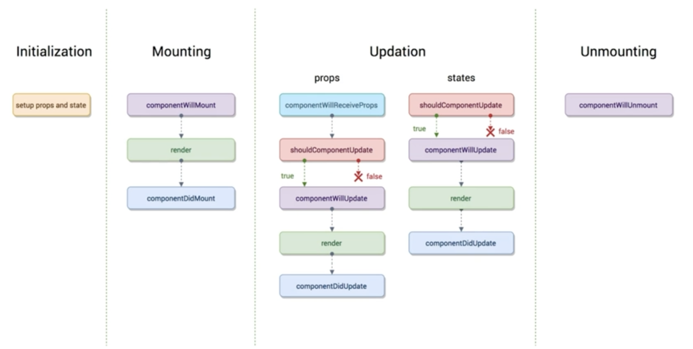

# 2022 / 2 / 14 react
## React Component : lifecycle

## react 16.3 이전 lifecycle
### Component 생성및 마운트
* constructor
* componentWillMount
* **render (최초)**
* componentDidMount
### Component props, state 변경
* componentWillReceiveProps
* shouldComponentUpdate
* componentWillUpdate
* **render**
* componentDidUpdate

#### componentWillReceiveProps (props의 변경)
state의 변경에 반응하지 않습니다. props 값에 따라 state를 변경하기 위해서는 setState를 이용합니다. 그러면 **다음 이벤트로 각각 가는것이 아니라 한번에 변경됩니다**

#### shouldComponentUpdate (props, state 변경)
props & state 둘 다 변경되이도 호출 되며 newProps 와 newState를 인자로 해 호출합니다.
return type 이 boolean(디폴트는 true) 값인데 true 면 render, false 면 render가 호출되지 않습니다.

#### componentWillUpdate (랜더되기 직전)
여기선 setState 같은 것을 쓰면 안됩니다.

#### componentDidUpdate (랜더링이 끝난 후)

### Component 언마운트
* componentWillUnmount
#### componentWillUnmount (컴포넌트가 종료되기 직전)

### 사용
일반적인 매서드와 사용 형태가 같습니다.
```js
class App extends React.Component {
    ...
        componentWillMount() {
          console.log("componentWillMount");
        }
      }
```
## react 16.3 이후 lifecycle

### Component 생성및 마운트
* constructor
* **getDerivedStateFromProps**
* render (최초)
* componentDidMount
### Component props, state 변경
* **getDerivedStateFromProps**
* shouldComponentUpdate
* **getSnapshotBeforeUpdate**
* render
* componentDidUpdate

### Component 언마운트
* componentWillUnmount

### Component 에러 캐치
* componentDidCatch

### 사용
앞에 static을 붙여 사용합니다.
```js
class App extends React.Component {
    ...
        static getDerivedStateFromProps() {
          console.log("componentWillMount");
        }
      }
```