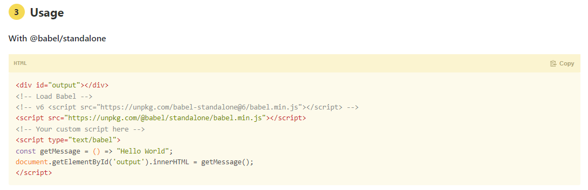

# 2022 / 2 / 7 react
## React Component : JSX
### JSX란?
JS의 확장 문법으로 babel을 통해 순수한 JS로 컴파일 하여 사용함.
##### JSX
```html
<div class = 'kim'>1</div>
```
##### JS
```js
React.createElement('div', {
    class: 'kim'
}, "1")
```
### JSX를 사용하기 위한 준비
JSX는 바벨을 통해 순수한 JS로 컴파일 되기 때문에 https://babeljs.io/setup#installation 을 참고 하여 미리 HTML에 script를 붙여줘야함

### JSX 주요 문법
* 최상위 효소는 하나여야 함
* 최상위 요소를 리턴하는 경우 ( ) 로 감싸야함
* `<>자식들</>`와 같이 자식을 바로 랜더링 할 수 있음
* {표현식}으로 JS 표현식을 사용
* style을 이용해 인라인 스타일링 가능
* class 대신 className을 사용해 class를 적용
* 태그를 꼭 닫아야함 